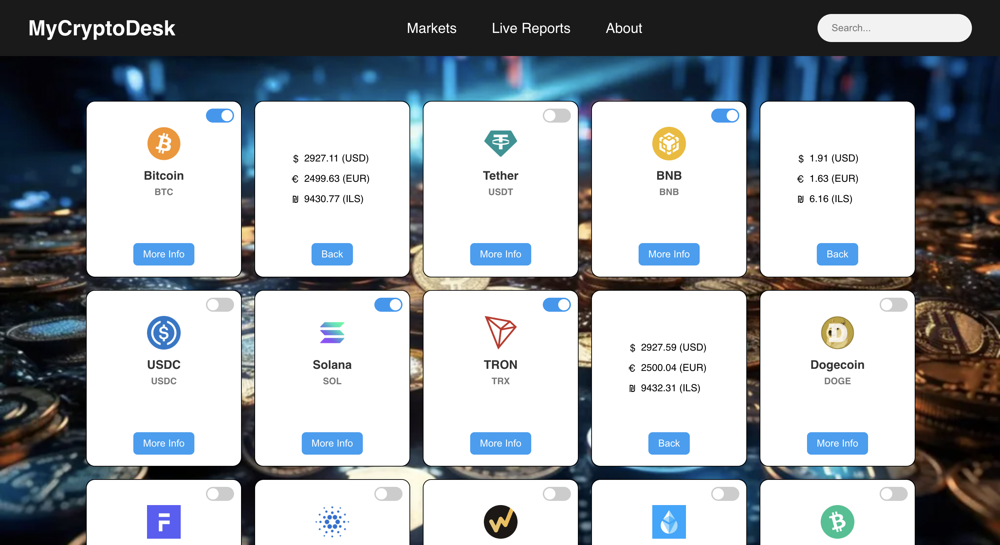
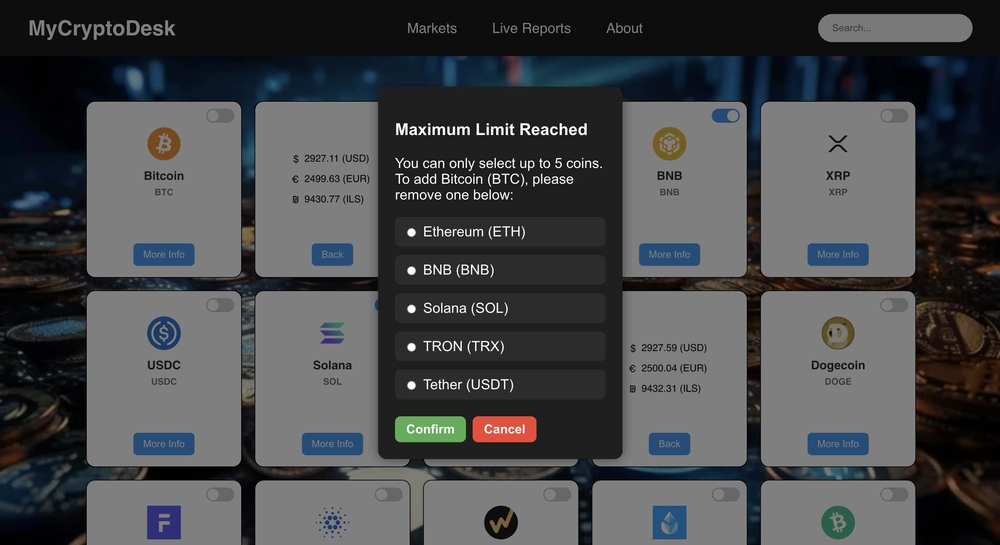

# MyCryptoDesk

A lightweight **vanilla JavaScript** crypto dashboard to browse market coins, pick up to **5 favorites**, and track them in **real time** using **ApexCharts**.

---

## Screenshots

### Markets


*Browse coins, flip cards for for more details, and select up to 5 favorites.*

### Live Reports


*Track live USD prices and percentage changes in real time using interactive charts.*

### Favorites Limit Dialog


*When the 5-coin limit is reached, a modal lets you replace an existing favorite.*


---

## Features

### Markets (index.html)
- Fetches coin market data from **CoinGecko**
- Displays coins as responsive cards (icon, name, symbol)
- **Live search** (name/symbol) with clear button
- **More Info** card flip:
  - Loads prices (USD / EUR / ILS) on demand
  - Shows loading + error states
- Favorites system (toggle switch)
  - **Limit: 5 coins**
  - Modal dialog to replace/remove a coin
  - Persists selection with **localStorage**

### Live Reports (live-reports.html)
- Real-time charts using **ApexCharts**
- Uses selected favorites to track:
  - **Live USD price**
  - **Live % change** (relative to the first price seen in the session)
- Updates every second
- Handles missing/invalid API responses and shows user-friendly messages

### About (about.html)
- Short overview of the project + author section

---

## Tech Stack

- **HTML / CSS / Vanilla JavaScript**
- **ApexCharts** (charts)
- **CoinGecko API** (markets + coin data)
- **CryptoCompare API** (live price polling)
- **LocalStorage** (cached coin list + selected favorites)

---

## Project Structure
```text
my-crypto-desk/
├─ index.html
├─ live-reports.html
├─ about.html
├─ style.css
├─ main.js
├─ live-reports.js
└─ assets/
   └─ images/
```
---

## How to Run

This is a static project (no backend).

### Option 1: VS Code Live Server (recommended)
1. Open the project folder in VS Code
2. Install the **Live Server** extension (if you don’t have it)
3. Right-click `index.html` → **Open with Live Server**

### Option 2: Any static server
You can also serve the folder using any simple static server.

---

## How to Use

1. Open **Markets**
2. Search coins or scroll the cards
3. Toggle up to **5** favorites
4. Go to **Live Reports**
5. Watch live USD + % change charts update in real time

If no coins are selected, Live Reports will guide you back to Markets.

---

## Notes & Limitations

- Live Reports requires selecting coins first (favorites are stored in localStorage).
- APIs may rate-limit or return missing prices for some symbols (handled with a message).
- This project is for learning/demo purposes (not financial advice).

---

## Credits

- Coin data: **CoinGecko API**
- Live prices: **CryptoCompare API**
- Charts: **ApexCharts**

---

## Author

**Tom Liron**  
Full-stack developer | Musician & educator
